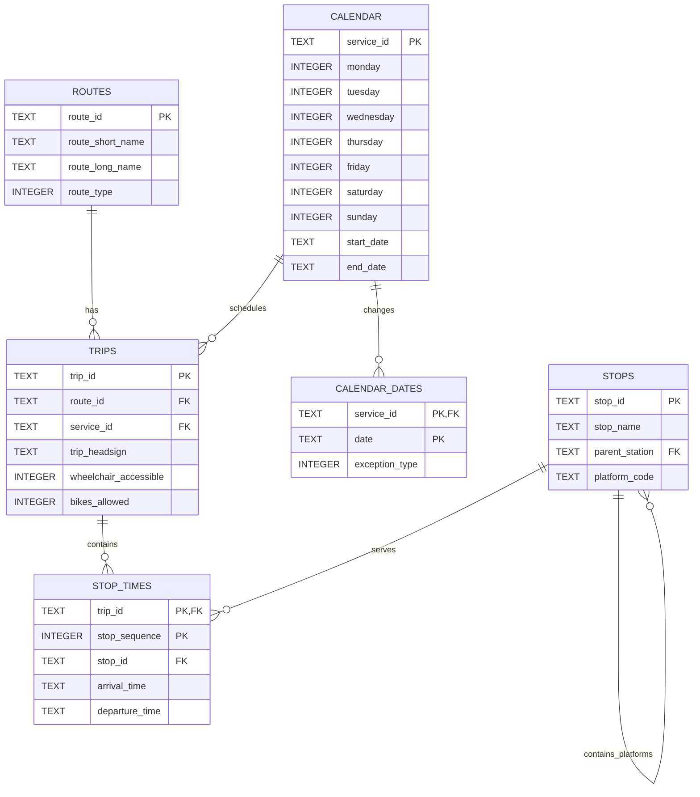

# RailPulse: Belgian Transit SQL Analysis

RailPulse is a SQL analysis project built from the official SNCB/NMBS public transport schedule. It downloads the Belgian GTFS feed, loads the useful data into a normalized SQLite database, and uses SQL to study network activity, platform usage, service frequency, destinations, and passenger amenities.

Python handles the download, CSV reading, database insertion, and presentation layer. The analytical calculations stay in SQL.

## Main Results

The included reports were generated for 22 July 2026.

| Analysis | Result |
| --- | --- |
| Peak departure hour | 17:00 with 2,808 scheduled departures |
| Busiest Brussels-Central platforms | Platform 4, followed by platforms 3 and 2 |
| Main morning destinations | Anvers-Central, Louvain, and Charleroi-Central |
| Weekly service frequency | 59.73% Medium, 28.83% High, 11.44% Low/Special |
| Passenger amenities | Bicycle storage is confirmed on every active train trip; wheelchair data is unspecified, so no weakest train route can be identified |

The full query outputs are stored in `results/` and can be regenerated for another date.

## Data Sources

The schedule database uses the official SNCB/NMBS GTFS Static feed:

```text
https://opendata-discovery-gtfs-static.api.production.belgianmobility.io/api/gtfs/feed/nmbssncb/static
```

The live departure collector uses the public iRail liveboard endpoint:

```text
https://api.irail.be/v1/liveboard
```

Neither endpoint requires an API key for this level of use. Static GTFS contains planned schedules. iRail provides current delays, cancellations, and platforms.

Source: NMBS-SNCB Open Data, licensed under CC BY 4.0.

## Architecture

```text
SNCB/NMBS GTFS endpoint
          |
          v
      ingest.py --------> sql/schema.sql
          |                    |
          v                    v
       GTFS ZIP --------> railpulse.db
                               |
                         sql/analysis.sql
                          /            \
                         v              v
                run_analysis.py     dashboard.py
                         |
                         v
                    results/*.csv

iRail liveboard ------> fetch_liveboard.py ------> live_departures
```

## Database Design



The schema separates routes, trips, stops, stop times, and service calendars instead of repeating the same route and station data in millions of rows. Primary and foreign keys protect the relationships between tables.

`sql/schema.sql` contains the complete database definition. `ingest.py` reads and executes this file before loading the GTFS rows.

## Project Structure

| Path | Purpose |
| --- | --- |
| `ingest.py` | Downloads GTFS data and builds the SQLite database |
| `sql/schema.sql` | Defines tables, keys, indexes, and the active-service view |
| `sql/analysis.sql` | Contains the five analytical SQL queries |
| `run_analysis.py` | Runs the SQL queries and saves CSV reports |
| `dashboard.py` | Displays the SQL results with Streamlit |
| `fetch_liveboard.py` | Appends a current Brussels-Central iRail snapshot |
| `explain_indexes.py` | Displays SQLite's query plan and index usage |
| `results/` | Contains generated report CSV files |
| `SQL&DB_theory.md` | Database and SQL technical reference |

## Installation

Clone the repository and open a terminal in its root folder.

```powershell
python -m venv .venv
.venv\Scripts\Activate.ps1
pip install -r requirements.txt
```

## Usage

### 1. Build the database

Choose a date covered by the downloaded feed:

```powershell
python ingest.py --date 2026-07-22
```

The first run downloads the GTFS ZIP and builds `data/railpulse.db`. Later runs reuse the cached ZIP.

To request a fresh copy of the feed:

```powershell
python ingest.py --date 2026-07-22 --download
```

### 2. Generate the reports

```powershell
python run_analysis.py
```

The reports are printed in the terminal and written to `results/`.

### 3. Open the dashboard

```powershell
streamlit run dashboard.py
```

Streamlit prints a local URL, usually `http://localhost:8501`, which opens the dashboard in a browser.

### 4. Collect a live snapshot

```powershell
python fetch_liveboard.py
```

Each run makes one iRail request and appends the current Brussels-Central departures to `live_departures`. Running it at different moments gradually builds a local history.

### 5. Inspect index usage

```powershell
python explain_indexes.py
```

This prints SQLite's execution strategy for the platform analysis and shows which indexes are used.

## SQL Analysis

The queries in `sql/analysis.sql` calculate:

1. The hour with the highest scheduled departure volume.
2. The three busiest Brussels-Central platforms.
3. The most common destinations for trips starting before noon.
4. Weekly service-frequency categories and their percentages.
5. Wheelchair and bicycle guarantees and data coverage for each train route.

The analysis uses joins, grouping, aggregate functions, `CASE WHEN`, common table expressions, a window function, and SQLite date functions.

## Technical Choices

- GTFS files are read directly from the ZIP instead of being extracted manually.
- Large CSV files are processed with generators and inserted in batches to limit memory use.
- A temporary database is built and validated before replacing the previous database.
- Foreign-key and integrity checks run after ingestion.
- GTFS times remain as text because valid GTFS schedules can continue past `24:00:00`.
- Static schedules and live observations are stored separately because they represent different facts.
- Indexes support the main joins and station/date filters.

## Limitations

GTFS Static contains planned schedules, not actual historical performance. The iRail collector starts building delay history only when it is run. A reliable multi-station punctuality comparison would require automated collection over a longer period.

Empty GTFS accessibility fields mean that availability is unknown, not that access is impossible. The project reports only features explicitly guaranteed by the feed.

The current feed marks bicycle storage as available on every active train trip but leaves wheelchair accessibility unspecified. Replacement buses are excluded from the train-route audit. Since every train route has the same values, the project reports that no weakest route can be distinguished instead of creating a misleading ranking.

## Timeline

The project was completed over five days:

- SQL and relational database concepts.
- Data modeling and small SQL exercises.
- SQLite schema and ingestion pipeline.
- Analysis queries, dashboard, and live-data connection.
- Testing, documentation, and bug fixing.

## Contributor

Becode provided and introduced me to the api and links to the dev portal of the SNCB
